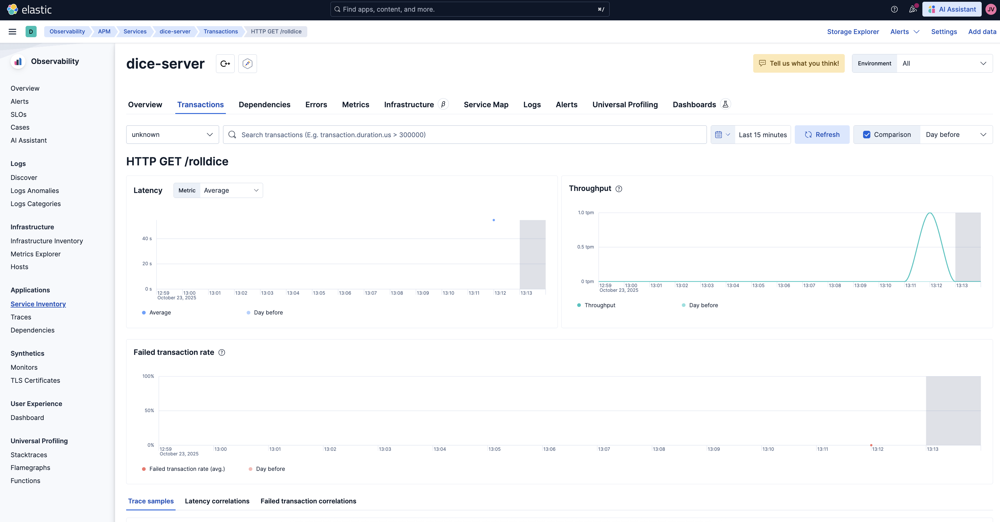

# otel-cpp-demo

A C++ demo project showcasing OpenTelemetry instrumentation on Ubuntu.  
This project demonstrates how to collect and export traces to Elastic APM **without modifying the original application code** by using a **preload tracer library**.

The demo includes a simple `roll-dice` server application, and the `preload_tracer.so` library automatically instruments it at runtime.

Based on https://opentelemetry.io/docs/languages/cpp/getting-started/

Once complete, your directory structure should resemble this:

$HOME/otel-cpp-demo  
├ images/  
├ oatpp/  
├ opentelemetry-cpp/  
├ roll-dice/   

## Prerequisites

Ensure that you have the following installed locally:

- Git
- C++ compiler supporting C++ version >= 14
- Make
- CMake version >= 3.25
- OpenSSL
- Zlib

---

## Steps

### Install Prerequisites:

```bash
sudo apt update
sudo apt install git
sudo apt install build-essential
sudo apt install cmake
sudo apt install libssl-dev
sudo apt install zlib1g-dev
```

---

### Clone the demo repository:

```bash
git clone https://github.com/elastic/otel-cpp-demo.git
cd otel-cpp-demo
```

---

### Build and install Oat++ framework

```bash
git clone https://github.com/oatpp/oatpp.git
cd oatpp
git checkout 1.3.0-latest
mkdir build
cd build

cmake ..
make
sudo make install
```

---

### Build and install OpenTelemetry C++ SDK

```bash
cd $HOME/otel-cpp-demo/
git clone https://github.com/open-telemetry/opentelemetry-cpp.git
cd opentelemetry-cpp
mkdir build
cd build

cmake -DBUILD_SHARED_LIBS=ON -DWITH_EXAMPLES=OFF -DWITH_OTLP_GRPC=ON -DWITH_OTLP_HTTP=ON -DBUILD_TESTING=OFF ..

cmake --build . -j$(nproc)
cmake --install . --prefix ../../otel-cpp
```

---

### Build the demo application

```bash
cd $HOME/otel-cpp-demo/roll-dice/
mkdir build
cd build
cmake ..
cmake --build .
```

---

### Build the preload tracer library

```bash
g++ -std=c++17 -shared -fPIC preload_tracer.cpp -o preload_tracer.so \
-I$HOME/otel-cpp-demo/otel-cpp/include \
$HOME/otel-cpp-demo/otel-cpp/lib/libopentelemetry_trace.so \
$HOME/otel-cpp-demo/otel-cpp/lib/libopentelemetry_exporter_otlp_http.so \
$HOME/otel-cpp-demo/otel-cpp/lib/libopentelemetry_resources.so \
$HOME/otel-cpp-demo/otel-cpp/lib/libopentelemetry_common.so
```

---

### Configure environment variables

```bash
export OTEL_EXPORTER_OTLP_ENDPOINT="<your-elastic-apm-url>/v1/traces"
export OTEL_EXPORTER_OTLP_HEADERS="Bearer <your-elastic-apm-api-key>"
export OTEL_SERVICE_NAME="dice-server"
export LD_LIBRARY_PATH=$HOME/otel-cpp-demo/otel-cpp/lib:$LD_LIBRARY_PATH
```

> ⚠️ Replace `<your-elastic-apm-url>` with your actual Elastic APM URL.  
> ⚠️ Replace `<your-elastic-apm-api-key>` with your actual Elastic APM API key.

---

### Run the demo application with tracing

```bash
LD_PRELOAD=$HOME/otel-cpp-demo/roll-dice/preload_tracer.so ./build/dice-server
```
Open a new terminal and run a few curl commands against the dice-server to generate APM traces.

```bash
curl http://localhost:8080/rolldice
```

---

If everything is configured correctly, you’ll see the server start up and traces appear in your Elastic APM instance.


